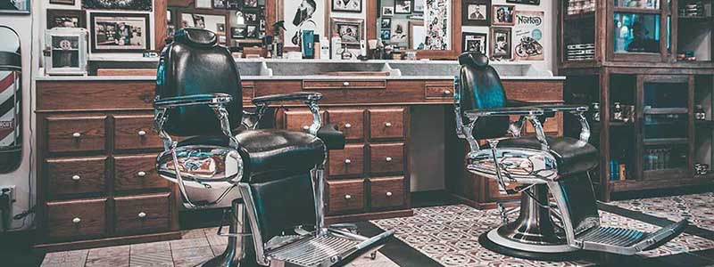

<h1 align="center">Barbería Alura</h1>

- Version Final

💈 Barbería Alura
Bienvenido al repositorio oficial de la Barbería Alura, un sitio web moderno y responsivo diseñado para ofrecer una experiencia premium tanto en escritorio como en dispositivos móviles.

Este proyecto destaca por el uso de técnicas avanzadas de CSS, integración de contenido multimedia y diseño semántico.

🚀 Características Principales
Diseño Multimedios: Integración de Google Maps para ubicación real y reproductores de video de YouTube.

Estilos Avanzados: Uso de degradados lineales, sombras (box-shadow), transiciones de opacidad y pseudo-elementos (★).

Tipografía Premium: Implementación de la fuente Montserrat vía Google Fonts.

Diseño Responsivo: Adaptabilidad total para pantallas móviles (máximo 480px) mediante Media Queries.

Interactividad: Efectos visuales en tarjetas de productos, imágenes de diferenciales y botones de formulario.

🛠️ Tecnologías Utilizadas
HTML5: Estructura semántica (Header, Main, Section, Footer).

CSS3: Layouts complejos, animaciones, degradados y responsividad.

Reset CSS: Normalización para visualización consistente en todos los navegadores.

Google Fonts API: Tipografía personalizada.

📄 Estructura del Sitio
🏠 Home (index.html)

La página principal presenta la historia de la barbería, su misión de "proporcionar autoestima y calidad de vida", una sección de ubicación con mapa interactivo y un video promocional.

✂️ Productos (productos.html)
Un catálogo visual de servicios que incluye:

Cabello: Corte con tijera o máquina.

Barba: Diseño profesional.

Combo: Paquete completo.

✉️ Contacto (contacto.html)
Formulario completo para clientes que incluye:

Campos de validación obligatorios.

Selección de métodos de contacto (WhatsApp, Email, Teléfono).

Selector de horarios y suscripción a novedades.

Tabla de horarios de atención detallada.

📐 Detalles Técnicos Destacados
Reset de Meyer: Se utiliza reset.css para eliminar márgenes y paddings por defecto del navegador.

Efectos Hover:

La imagen de diferenciales reduce su opacidad al 30% con una transición de 400ms.

El botón de envío se escala un 20% (scale(1.2)) al pasar el cursor.

Mobile First (Ajustes): En pantallas pequeñas, el menú de navegación se vuelve estático y los anchos de los contenedores se ajustan automáticamente al 100% para evitar el scroll horizontal.

├── index.html           # Página de inicio (Sobre nosotros, Mapa, Video)
├── productos.html       # Catálogo de servicios
├── contacto.html        # Formulario de contacto y horarios
├── style.css            # Hoja de estilos principal y Responsividad
├── reset.css            # Normalización de estilos
├── imagenes/            # Galería de servicios y logos
├── banner/              # Imágenes principales de cabecera
└── diferenciales/       # Imágenes de la sección de ventajas

👤 Autor
Proyecto realizado siguiendo las mejores prácticas de Alura Latam y Oracle Next Education.

 

 
